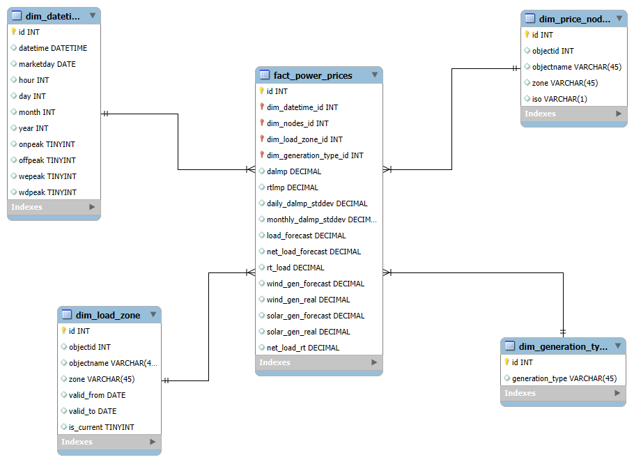
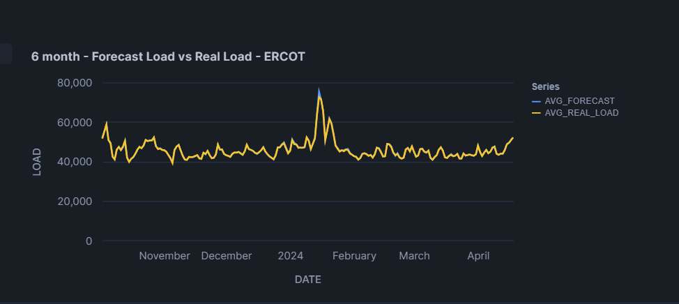
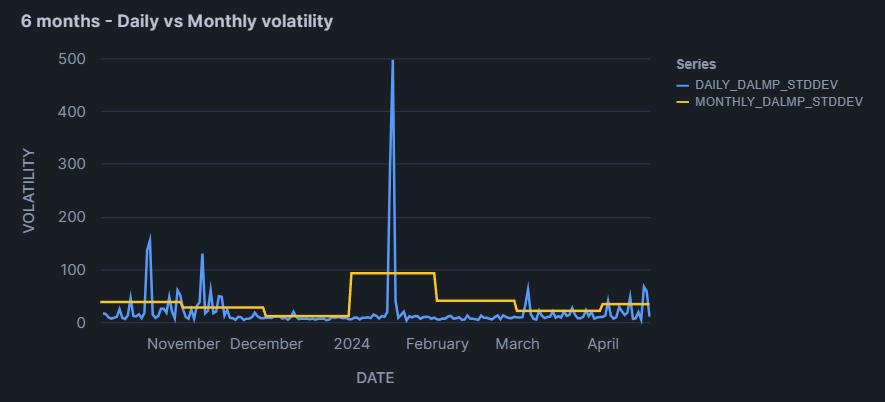
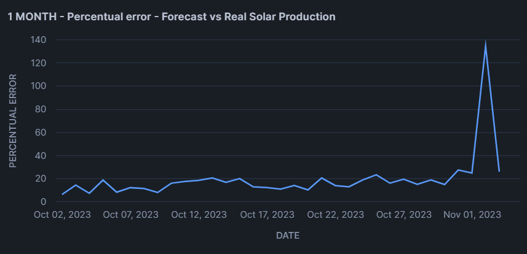
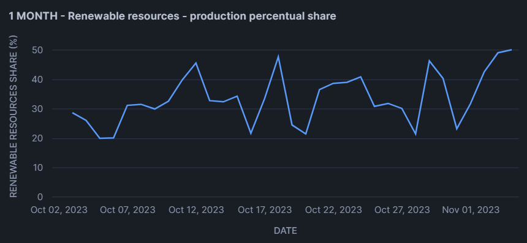

ELT proces datasetu YES ENERGY

# 1. ÚVOD A POPIS ZDROJOVÝCH DÁT

V tomto projekte analyzujeme dáta o elektrickej energii, jej cenách, zmenách cien v čase a vplyv obnoviteľnej energie na produkciu aj cenu elektrickej energie v regióne ERCOT. Analýza prebieha na základe dát z datasetu Yes Energy.

Cieľom je analyzovať a porozumieť:
1. Presnosti predikcie spotreby elektrickej energie (graf1, graf 3, graf4)
2. Stúpaniu a klesaniu cien elektrickej energie v čase (graf2)
3. Vplyvu používania obnoviteľných zdrojov, ich výhody a nevýhody (graf 5, graf6)

Dáta z datasetu Yes Energy boli analyzované a extrahované nasledujúcich tabuliek:
dart_loads_sample (údaje o skutočnej spotrebe elektrickej energie)
dart_prices_sample (cenové údaje pre jednotlivé územné uzly a oblasti)
ds_object_list_sample (informácie o všetkých objektoch - uzly, oblasti, load zones...)
iso_market_times_sample (časové údaje)
ts_forecast_sample (údaje predikcií výroby elektrickej energie)
sts_gen_sample (údaje reálnej výroby elektrickej energie obnoviteľných zdrojov)

---

## 1.1 Dátová architektúra
Surové dáta z datasetu Yes Energy sú usporiadané v relačnom modeli, zobrazenom v nasledujúcom ERD Diagrame

---

# 2. DIMENZIONÁLNY MODEL

Star schema obsahuje 1 tabuľku faktov fact_power_prices a 4 dimenzie:
1. dim_datetime - dimenzia času, obsahuje údaje o čase záznamu, na faktovú tabuľku je napojená skrz datetime_id, SCD0
2. dim_load_zone - obsahuje údaje o load zónach a geografických oblastiach na predikciu výroby elektricej energie, zaznamenáva či je údaj platný a aktuálny. Na faktovú tabuľku je napojená skrz load_zone_id, SCD2
3. dim_price_nodes - informácie o uzloch na určovanie cien elektrickej energie, napojená na faktovú tabuľku skrz price_nodes_id, SCD1
4. dim_generation_type - údaje o type produkovanej elektrickej energie (solar,wind,...), napojené na faktovú tabuľku skrz generation_type_id, SCD0

FACT TABLE
1. PK - id
2. FK - dim_datetime_id, dim_nodes_id, dim_load_zone_id, dim_generation_type_id
Hlavné metriky - dalmp, rtlmp, ich stddev hodnoty, load_forecast, net_load_forecast, rt_load, údaje o predikcií a realnej produkcií obnoviteľných zdrojov, net_load_rt

---

# 3. ELT

## 3.1 EXTRACT
Dáta z vyššie uvedených tabuliek boli extrahované z datasetu Yes Energy (yes_energy__sample_data) zo schémy yes_energy_sample
Príklad kódu : select * from yes_energy__sample_data.yes_energy_sample.dart_loads_sample

Staging tabuľky boli všetky vytvárané pomocou odporúčaného postupu zo zadania CREATE OR REPLACE TABLE + SELECT * FROM ... 

Príklad kódu: 
create or replace table stg_nodes AS
SELECT objectid, 
objectname, 
objecttype,
zone,
iso
from yes_energy__sample_data.yes_energy_sample.ds_object_list_sample
where iso = 'ERCOT';

Pri tvorbe staging tabuliek pomocou týchto dotazov išlo o vytiahnutie potrebných informácií na neskoršiu analýzu zo zdrojových tabuliek datasetu. V tomto konkrétnom príklade vytvárame tabuľku obsahujúcu údaje o objekte (id, name, type) a filtrujeme záznamy podľa parametru iso = ERCOT. Je to z dôvodu, že analýza je zameraná len na tento región.

## 3.2 LOAD

Po vytvorení star schemy, tabulky faktov a tabuliek dimenzii som nahral údaje do tabuliek pomocou INSERT INTO + SELECT DISTINCT zo staging tabuľky do tabuľky dimenzie alebo v prípadne nutnosti pomocou MERGE INTO - využíva target table tgt ktorú upravuje/aktualizuje a source table src z ktorej čerpá aktuálne údaje. V princípe spája príkazy INSERT INTO a UPDATE, použiva sa najmä pri SCD1 a SCD2, kde je dôležitá aktuálnosť údajov a ich vývoj v čase.

Príklad kódu s MERGE INTO:
merge into dim_price_nodes tgt
using(
select distinct
objectid,
objectname,
zone
from stg_nodes
where objecttype = 'price_node'
) src
on tgt.objectid = src.objectid

when matched then
update set
tgt.objectname = src.objectname,
tgt.zone = src.zone

when not matched then
insert(
objectid,
objectname,
zone
)
values(
src.objectid,
src.objectname,
src.zone
);

V tomto konkrétnom kóde potrebujeme merge into na to, aby sa záznam aktualizoval ak už existuje, a aby sa vytvoril nový ak už existuje (when matched, when not matched)

## 3.3 TRANSFORM

Transform údajov sa čiastočne dial počas celej dobu procesu extract a load, kde sme vybrali najmä údaje potrebné na analýzu a na dosiahnutie jej cieľa, či už do staging tabuliek alebo do faktovej tabuľky a dimenzií. 
Proces Transform je najviac vidieť najmä na faktovej tabuľke - napríklad window functions:

Príklad kódu:
select
dt.id as datetime_id,
pn.id as price_nodes_id,
lz.id as load_zone_id,
135690 as generation_type_id,
pr.dalmp,
pr.rtlmp,
stddev(pr.dalmp) over(partition by dt.marketday) as daily_dalmp_stddev,
stddev(pr.dalmp) over(partition by month(dt.marketday)) as monthly_dalmp_stddev,
lf.value as load_forecast,
lf.value - wf.value - sf.value as net_load_forecast,
ld.load_gen as rt_load,
ld.load_gen - wg.wind_gen - sg.solar_gen as net_load_rt
from dim_datetime dt
inner join stg_prices pr on pr.datetime = dt.datetime
inner join dim_price_nodes pn on pn.objectid = pr.objectid
inner join dim_load_zone lz on lz.objectid = 10000712973 and lz.is_current = true
left join stg_load_forecast lf on lf.datetime = dt.datetime and lf.datatypeid = 19060
left join stg_load_forecast wf on wf.datetime = dt.datetime and wf.datatypeid = 9285
left join stg_load_forecast sf on sf.datetime = dt.datetime and sf.datatypeid = 662
left join stg_real_load ld on ld.datetime = dt.datetime
left join stg_real_wind wg on wg.datetime = dt.datetime
left join stg_real_solar sg on sg.datetime = dt.datetime;

V danom kóde môžeme vidieť napĺňanie tabuľky faktov, transformáciu dát pre účely analýzy (window functions stddev) či napríklad net_load_forecast - všetky tieto stĺpce boli transformované na dáta, ktoré využivame neskôr pri vizualizacií a analýze a uľahčujú nám celkovú prácu s tabuľkami. Vo faktovej tabuľke môžeme vidieť mapovanie k dimenziám pomocou join/left join, ako aj používanie správnych SCD typov. Odstránenie duplikácií v dimenziách sme dosiahli pomocou SELECT DISTINT pri INSERT INTO/MERGE INTO.

Príklad kódu:
insert into dim_datetime(
datetime,
marketday,
hour,
day,
month,
year,
onpeak,
offpeak,
wepeak,
wdpeak
)
select distinct
datetime,
marketday,
extract(hour FROM datetime) as hour,
extract(day FROM datetime) as day,
extract(month FROM datetime) as month,
extract(year FROM datetime) as year,
onpeak,
offpeak,
wepeak,
wdpeak
FROM stg_times;

---

# 4.VIZUALIZÁCIA DÁT

//graf1
select
dt.marketday,
avg(fp.load_forecast) as avg_forecast,
avg(fp.rt_load) as avg_real_load
from fact_power_prices fp
join dim_datetime dt on fp.datetime_id = dt.id
where fp.generation_type_id = 135690
group by dt.marketday
order by dt.marketday
limit 200;

Účelom tohto grafu je vizualizovať rozdiel medzi predpovedanou a skutočnou spotrebou elektrickej energie v regióne ERCOT v rozmedzí približne 6 mesiacov (november 2023 - apríl 2024) a analyzovať presnosť predpovedí.

---

//graf2
select 
dt.marketday,
avg(fp.daily_dalmp_stddev) as daily_dalmp_stddev,
avg(fp.monthly_dalmp_stddev) as monthly_dalmp_stddev
from fact_power_prices fp
join dim_datetime dt on fp.datetime_id = dt.id
group by marketday
order by marketday
limit 200;

Účelom tohto grafu je vizualizovať kolísanie cien elektrickej energie v regióne ERCOT po dobu približne 6 mesiacov. Klesanie a stúpanie cien (volatilita) je zobrazené pomocou denného a mesačného priemeru.

---

//graf3
select 
dt.datetime,
wf.value as forecast,
wg.wind_gen as actual,
abs(wg.wind_gen - wf.value) / nullif(wf.value,0)*100 as perc_error
from dim_datetime dt
join stg_load_forecast wf on wf.datetime = dt.datetime and wf.datatypeid = 9285
join stg_real_wind wg on wg.datetime = dt.datetime
order by dt.datetime
limit 800;

//graf4
select 
dt.datetime,
sf.value as forecast,
sg.solar_gen as actual,
abs(sg.solar_gen - sf.value) / nullif(sf.value,0)*100 as perc_error
from dim_datetime dt
join stg_load_forecast sf on sf.datetime = dt.datetime and sf.datatypeid = 662
join stg_real_solar sg on sg.datetime = dt.datetime
order by dt.datetime
limit 800;

V grafoch 3 a 4 ide o bližšiu analýzu obnoviteľných zdrojov elektrickej energie - grafy zobrazujú presnosť predikcie spotreby solárnej a veternej elektrickej energie dôležité pre neskoršie porovnávanie využiteľnosti a výhod obnoviteľných zdrojov elektrickej energie.

---

//graf5
select
dt.datetime,
sum(coalesce(wg.wind_gen_real,0) + coalesce(sg.solar_gen_real,0)) / sum(f.rt_load)*100 as renewables_share_perc,
from dim_datetime dt
left join fact_power_prices f on f.datetime_id = dt.id and f.generation_type_id = 135690
left join fact_power_prices wg on wg.datetime_id = dt.id and wg.generation_type_id = 135688
left join fact_power_prices sg on sg.datetime_id = dt.id and sg.generation_type_id = 135689
group by dt.datetime
order by dt.datetime
limit 800;

Graf číslo 5 zobrazuje percentuálny podiel obnoviteľných zdrojov na výrobe elektrickej energie.

---

//graf6
select
dt.marketday,
avg(f.daily_dalmp_stddev) as daily_price_volatility,
sum(coalesce(wg.wind_gen_real,0) + coalesce(sg.solar_gen_real,0))
/ nullif(sum(f.rt_load),0)*100 as renewables_share_perc
from fact_power_prices f
join dim_datetime dt on f.datetime_id = dt.id
left join fact_power_prices wg on wg.datetime_id = dt.id and wg.generation_type_id = 135688
left join fact_power_prices sg on sg.datetime_id = dt.id and sg.generation_type_id = 135689
where f.generation_type_id = 135690
group by dt.marketday
order by dt.marketday
limit 200;

Graf číslo 6 analyzuje súvis medzi priemernou dennou volatilitou a produkciou obnoviteľných zdrojov, vizualizuje kedy stúpa a kedy klesá cena elektrickej energie a zároveň vyjadruje produkciu elektrickej energie obnoviteľnými zdrojmi v tom istom čase. Vyjadruje, či majú obnoviteľné zdroje a ich produkcia dopad na kolísanie cien a do akej miery.

Samuel Akúč
